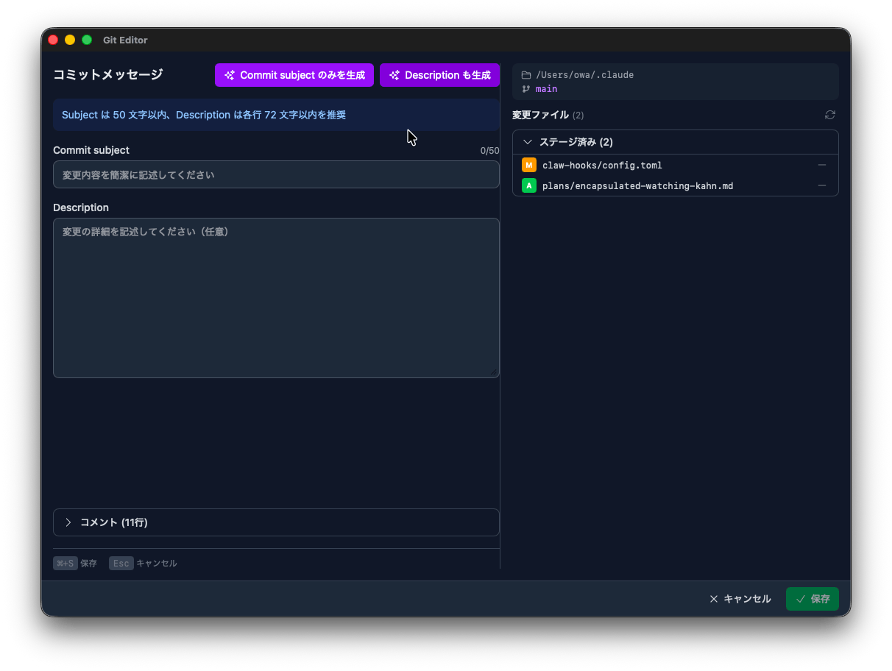
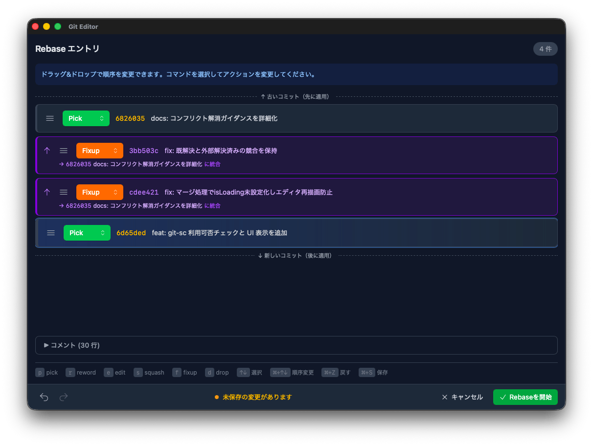
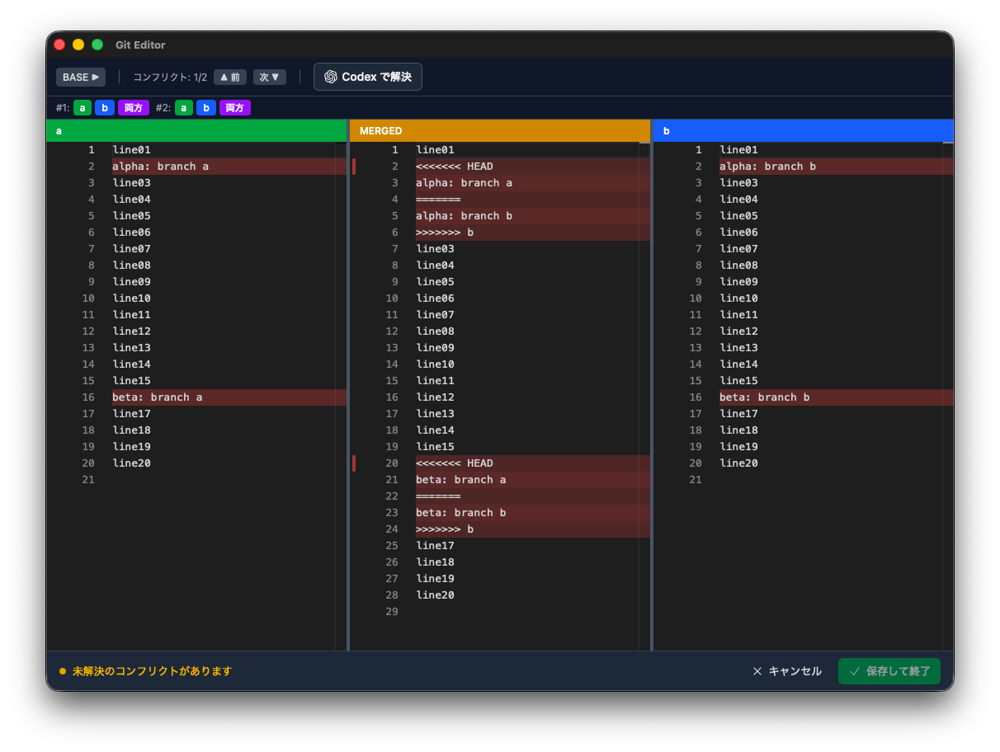

<p align="center">
  
</p>

<h1 align="center">GUI Git Editor</h1>

<p align="center">
  Git操作（rebase、コミットメッセージ編集、マージコンフリクト解決）をGUIで直感的に
</p>

<p align="center">
  <a href="https://github.com/owayo/gui-git-editor/actions/workflows/release.yml">
    
  </a>
  <a href="https://github.com/owayo/gui-git-editor/releases/latest">
    
  </a>
  <a href="LICENSE">
    
  </a>
</p>

---

## 概要

`git config --global core.editor` で設定して使用可能なGUIエディタ。
Interactive rebase、commit message編集、squash、rewordなどをすべてサポート。
`git mergetool` としても使用可能で、Monaco Editor ベースの3パネルマージビューでコンフリクトを直感的に解決できます。

## Features

- ✨ **Interactive Rebase** - ドラッグ&ドロップでコミットの並び替え
- ⌨️ **キーボード操作** - ショートカットで高速なコマンド変更（p/r/e/s/f/d）
- 🤖 **AIコミットメッセージ** - [git-smart-commit](https://github.com/owayo/git-smart-commit) 連携で自動生成
- 🔄 **Undo/Redo** - 操作の取り消し・やり直し
- 🌙 **ダークモード** - システムテーマに自動追従
- 🔀 **Merge Tool** - 3パネルビューでコンフリクト解決（LOCAL / MERGED / REMOTE）
- 🤖 **Codex 連携** - [Codex CLI](https://github.com/openai/codex) + iTerm2 でコンフリクトを自動解決
- ♿ **アクセシビリティ** - ARIA属性、フォーカス管理対応

## Screenshots

### Commit Message Editor

<p align="center">
  
</p>

### Interactive Rebase

<p align="center">
  
</p>

### Merge Tool

<p align="center">
  
</p>

## Download

| Platform | Download |
|----------|----------|
| macOS (Apple Silicon) | [.dmg](https://github.com/owayo/gui-git-editor/releases/latest) |
| macOS (Intel) | [.dmg](https://github.com/owayo/gui-git-editor/releases/latest) |

## Installation

1. [Releases](https://github.com/owayo/gui-git-editor/releases/latest) から `.dmg` をダウンロード
2. アプリを `/Applications` にコピー

#### 初回起動時の注意

macOS では、署名されていないアプリは Gatekeeper によってブロックされます。
「開発元を確認できない」エラーが表示される場合は、初回起動前に以下のコマンドで隔離属性を削除してください:

```bash
xattr -d com.apple.quarantine /Applications/gui-git-editor.app
```

## Usage

### Git commit 時のエディタとして設定

```bash
git config --global core.editor '"/Applications/gui-git-editor.app/Contents/MacOS/gui-git-editor"'
```

### Git rebase -i 時のエディタとして設定

```bash
git config --global sequence.editor '"/Applications/gui-git-editor.app/Contents/MacOS/gui-git-editor"'
```
※ `sequence.editor` 未設定時は `rebase -i` 時、`core.editor` が使用されます。`rebase -i` 時だけ使いたい場合に設定してください。

### Git マージツールとして設定

```bash
git config --global mergetool.gui-git-editor.cmd \
  '"/Applications/gui-git-editor.app/Contents/MacOS/gui-git-editor" --merge --local "$LOCAL" --remote "$REMOTE" --base "$BASE" --merged "$MERGED"'
git config --global mergetool.gui-git-editor.trustExitCode true
git config --global merge.tool gui-git-editor
```

コンフリクト発生時に `git mergetool` を実行すると、3パネルのマージビューが起動します:

- **左パネル (LOCAL)**: 現在のブランチの変更内容（読み取り専用）— ヘッダーにブランチ名を表示
- **中央パネル (MERGED)**: 解決結果を編集するエディタ
- **右パネル (REMOTE)**: マージ元ブランチの変更内容（読み取り専用）— ヘッダーにブランチ名を表示

BASE パネルはツールバーの「BASE」ボタンで表示/非表示を切り替えられます。

#### Codex CLI による自動解決

[Codex CLI](https://github.com/openai/codex) と [iTerm2](https://iterm2.com/) がインストールされている場合、ツールバーの「Codex で解決」ボタンでコンフリクトを自動解決できます。
iTerm2 が起動中であれば新規タブで、未起動の場合は新規ウィンドウで Codex が開きます。

```bash
npm install -g @openai/codex
brew install --cask iterm2  # 未インストールの場合
```

### 動作確認

```bash
git commit                # コミットメッセージ編集
git rebase -i HEAD~3      # Interactive Rebase
git commit --amend        # コミットメッセージ修正
git mergetool             # マージコンフリクト解決
```

## Keyboard Shortcuts

### 共通

| キー | 動作 |
|------|------|
| `⌘+S` | 保存して終了 |
| `Escape` | キャンセル |

### Interactive Rebase

| キー | 動作 |
|------|------|
| `↑` / `↓` | コミット選択 |
| `⌘+↑` / `⌘+↓` | 順序変更 |
| `p` `r` `e` `s` `f` `d` | コマンド変更 |
| `⌘+Z` | Undo |
| `⌘+⇧+Z` | Redo |

### Merge Tool

| キー | 動作 |
|------|------|
| `⌘+S` | 保存して終了 |
| `Escape` | キャンセル |
| `⌥+↓` | 次のコンフリクトへ移動 |
| `⌥+↑` | 前のコンフリクトへ移動 |
| `⌘+Z` | Undo |
| `⌘+⇧+Z` | Redo |

## Development

### Requirements

- Node.js 18+
- Rust 1.70+
- pnpm

### Setup

```bash
pnpm install
pnpm tauri dev
```

### Build

```bash
pnpm tauri:build          # リリースビルド
pnpm tauri:build:debug    # デバッグビルド
```

### Tech Stack

- **Frontend**: React 19, TypeScript, Tailwind CSS v4, Zustand, Monaco Editor, dnd-kit
- **Backend**: Rust, Tauri v2
- **Build**: Vite

## License

[MIT](LICENSE)
